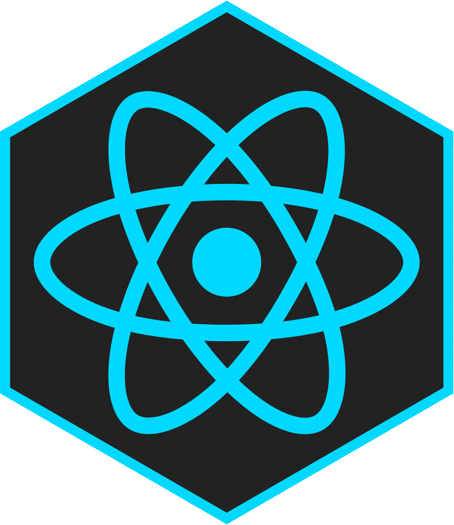
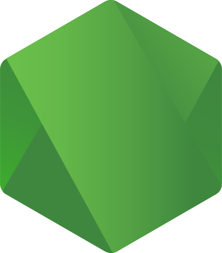
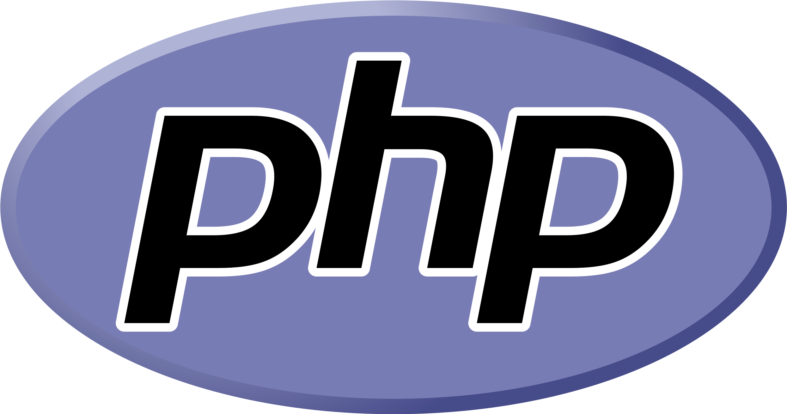
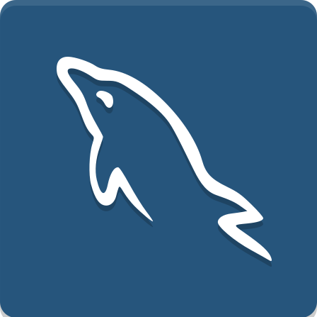

 

 

 
 
<h3 align="center" style="text-align: center">I can confidently create a production-ready application using:</h3>

<code></code>
<code></code>
<code></code>
<code></code>
<code></code>
<code></code>
<code></code>
<code></code>
<code></code>
<code></code>
<code></code>

 

I have been developing since I was nine years old, and my love for the creative process has only grown stronger over the years. I have extensive experience and commitment to user-centric design that ensures that every application I develop is intuitive, engaging, and tailored to the unique needs of its users.

</a> 

