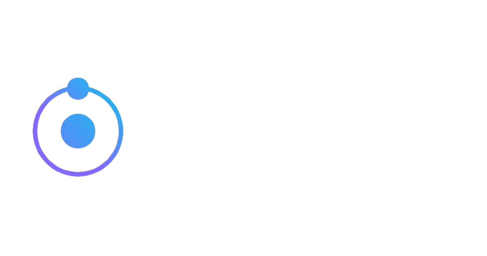

 

**About me**

- 💼 10th Grade Student in California

- 📈 Built my portfolio website, minecraft servers, discord selfbots, and much more

- ❤️ I love writing in JavaScript, and building fun experiments on type-level

- 💬 Ask me about anything [here](https://github.com/owengregson/owengregson/issues)

<code></code>
<code></code>
<code></code>
<code></code>
<code></code>    

| </a> |  |
| ------------- | ------------- |

#### Top Repositories

  

  

 
 

